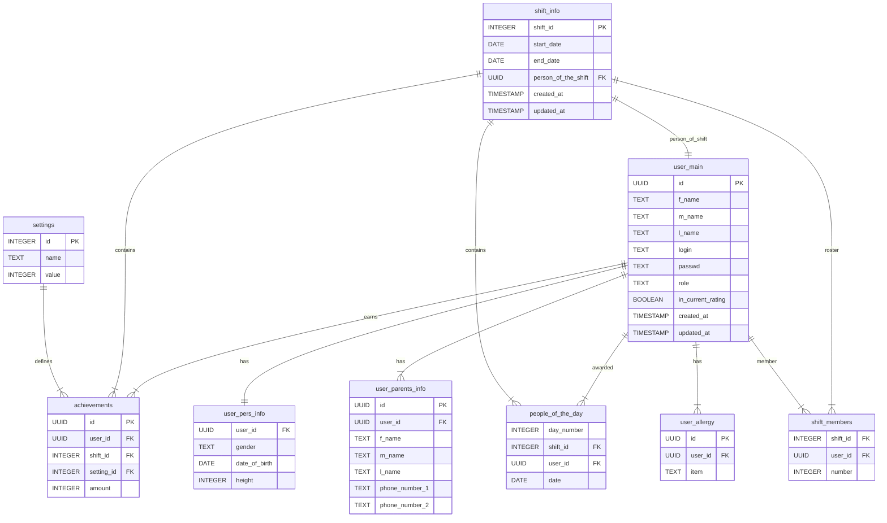

# Схема базы данных — Искры

## Общая идея

Приложение отслеживает достижения детей по сменам. Дети приезжают на смены, получают достижения — мы всё это фиксируем и считаем статистику.

Данные нормализованы: достижения хранятся не колонками, а строками. Новое достижение = новая строка в справочнике, без изменения схемы. Схема находиться в 3 нормальной форме. Нет полей, которе определяются через другие неключевые.

## Таблицы

### user_main

Основная таблица пользователей. Хранит и детей, и админов — разделяем через поле `role`.

| Поле       | Тип       | Описание                  |
| ---------- | --------- | ------------------------- |
| id         | UUID PK   | Уникальный идентификатор  |
| f_name     | TEXT      | Имя                       |
| m_name     | TEXT      | Отчество                  |
| l_name     | TEXT      | Фамилия                   |
| login      | TEXT      | Логин                     |
| passwd     | TEXT      | Хэш пароля (bcrypt)       |
| role       | TEXT      | Роль: `admin` или `child` |
| in_current_rating | BOOLEAN | В текущем рейтинге (ручной opt-out, DEFAULT true). Совершеннолетние (18+ по `date_of_birth`) исключаются автоматически при чтении |
| created_at | TIMESTAMP | Дата создания             |
| updated_at | TIMESTAMP | Дата обновления           |

### user_pers_info

Доп. информация о ребёнке. Связь один к одному с `user_main`.

| Поле          | Тип     | Описание            |
| ------------- | ------- | ------------------- |
| user_id       | UUID FK | Ссылка на user_main |
| gender        | TEXT    | Пол                 |
| date_of_birth | DATE    | Дата рождения       |
| height        | INTEGER | Рост                |

### user_parents_info

Информация о родителях. У ребёнка может быть несколько записей — один или два родителя.

| Поле           | Тип     | Описание                 |
| -------------- | ------- | ------------------------ |
| id             | UUID PK | Уникальный идентификатор |
| user_id        | UUID FK | Ссылка на user_main      |
| f_name         | TEXT    | Имя родителя             |
| m_name         | TEXT    | Отчество                 |
| l_name         | TEXT    | Фамилия                  |
| phone_number_1 | TEXT    | Основной телефон         |
| phone_number_2 | TEXT    | Дополнительный телефон   |

### user_allergy

Аллергии и особенности питания ребёнка. Один пункт — одна строка (один ко многим). Хранится отдельно от `user_pers_info`, чтобы каждый пункт был отдельно запрашиваемым. Только для админа/внутренней работы — в Искрах не показывается.

| Поле    | Тип     | Описание                 |
| ------- | ------- | ------------------------ |
| id      | UUID PK | Уникальный идентификатор |
| user_id | UUID FK | Ссылка на user_main      |
| item    | TEXT    | Пункт (аллерген / диета) |

### shift_info

Информация о сменах. Номера смен идут не подряд (83, 84, 90, 94...).

| Поле                | Тип        | Описание                            |
| ------------------- | ---------- | ----------------------------------- |
| shift_id            | INTEGER PK | Номер смены                         |
| start_date          | DATE       | Дата начала                         |
| end_date            | DATE       | Дата окончания                      |
| person_of_the_shift | UUID FK    | Человек смены (ссылка на user_main) |
| person_count_override | INTEGER  | Если задан — заменяет размер ростера в формуле сложности (архив = 40) |
| created_at          | TIMESTAMP  | Дата создания                       |
| updated_at          | TIMESTAMP  | Дата обновления                     |

> Смена `shift_id = 1` — псевдо-смена «Архив (до 83 смены)»: агрегат достижений детей за смены до 83-й, `person_count_override = 40` (сложность 1.59). Обычные смены — 83+. Подробнее — `data_rebuild_archive.md`.

### settings

Справочник достижений с коэффициентами. Сердце системы подсчёта.

| Поле  | Тип        | Описание                       |
| ----- | ---------- | ------------------------------ |
| id    | INTEGER PK | Уникальный идентификатор       |
| name  | TEXT       | Название достижения            |
| value | INTEGER    | Количество очков за достижение |

Пример данных:

- `reality_show_winner` — 3500
- `stars_winner` — 2500
- `recognition` — 500

### achievements

Записи о достижениях детей на сменах. Нормализованная таблица — каждая строка это одно достижение одного ребёнка на одной смене.

| Поле       | Тип        | Описание                                     |
| ---------- | ---------- | -------------------------------------------- |
| id         | UUID PK    | Уникальный идентификатор                     |
| user_id    | UUID FK    | Ссылка на user_main                          |
| shift_id   | INTEGER FK | Ссылка на shift_info                         |
| setting_id | INTEGER FK | Ссылка на settings                           |
| amount     | INTEGER    | Значение (0/1 для булевых, 0-N для числовых) |

Подсчёт очков: `amount * settings.value`, потом `SUM` по нужной выборке.

### shift_members

Ростер смены — кто на ней был (включая тех, кто ничего не набрал). Размер ростера = `person_count` в формуле сложности. Составной PK: `(shift_id, user_id)`.

| Поле     | Тип        | Описание                                              |
| -------- | ---------- | ----------------------------------------------------- |
| shift_id | INTEGER FK | Ссылка на shift_info                                  |
| user_id  | UUID FK    | Ссылка на user_main                                   |
| number   | INTEGER    | Стартовый номер ребёнка на смене («Генерация номеров»), null пока не сгенерирован |

### people_of_the_day

Человек дня. В один день может быть несколько человек дня — каждый в отдельной строке. Составной PK: `(day_number, shift_id, user_id)`.

| Поле       | Тип        | Описание             |
| ---------- | ---------- | -------------------- |
| day_number | INTEGER    | Номер дня на смене   |
| shift_id   | INTEGER FK | Ссылка на shift_info |
| user_id    | UUID FK    | Ссылка на user_main  |
| date       | DATE       | Фактическая дата     |

### Ведение смены (миграции 020–023)

Сырые факты традиций, из которых достижения смены пересчитываются целиком. Пишутся только смены с `shift_info.live_mode = true`.

| Таблица               | Ключ                                          | Зачем                                                             |
| --------------------- | --------------------------------------------- | ----------------------------------------------------------------- |
| shift_award           | `(shift_id, kind, day_number, user_id)`        | Именные награды; `kind` = `settings.name`, `day_number = 0` у финальных |
| shift_team            | `id BIGSERIAL`, UNIQUE `(shift_id, contest, name)` | Команды КТБ/КТП                                                |
| shift_team_member     | `(team_id, user_id)`                           | Составы команд                                                    |
| ktb_stage             | `id`, UNIQUE `(shift_id, number)`              | Этапы КТБ                                                         |
| ktb_stage_score       | `(stage_id, team_id)`                          | Баллы команды за этап                                             |
| ktp_cup               | `id`                                           | Кубки КТП (кубок выдаётся команде)                                |
| shift_contest_winner  | `(shift_id, contest)`                          | Ручной выбор победителя при равенстве                             |
| shift_day             | `(shift_id, day_number)`                       | `ready_at` — админ отдал искры за день                            |
| shift_day_award       | `(shift_id, user_id, day_number, setting_id)`  | Разбивка искр по дням (без коэффициента)                          |
| shift_day_opened      | `(shift_id, user_id, day_number)`              | Ребёнок открыл карточку дня                                       |
| ktb_team_opened       | `(shift_id, user_id)`                          | Ребёнок открыл сундук с составами КТБ                             |

`shift_info` дополнена: `live_mode BOOLEAN` (режим ведения) и `ktb_reveal_at TIMESTAMPTZ` — момент, в который дети узнают свои команды КТБ. Пока `ktb_reveal_at` пуст или не наступил, сервер состав ребёнку не отдаёт (сами составы при этом уже лежат в `shift_team_member`, поэтому этапы и подсчёт искр работают без изменений).

## Связи

```
user_main ||--|| user_pers_info        (один к одному)
user_main ||--|{ user_parents_info     (один ко многим)
user_main ||--|{ user_allergy          (один ко многим)
user_main ||--|{ achievements          (один ко многим)
user_main ||--|{ people_of_the_day     (один ко многим)
shift_info ||--|{ achievements         (один ко многим)
shift_info ||--|{ people_of_the_day    (один ко многим)
shift_info ||--|| user_main            (человек смены)
shift_info ||--|{ shift_members        (ростер, один ко многим)
user_main  ||--|{ shift_members        (ростер, один ко многим)
settings ||--|{ achievements           (один ко многим)
```

## ER-диаграмма (Mermaid)


